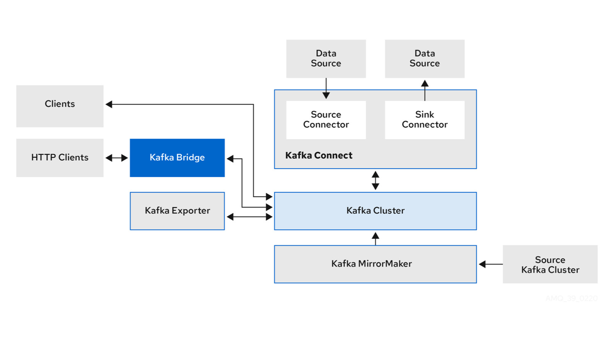
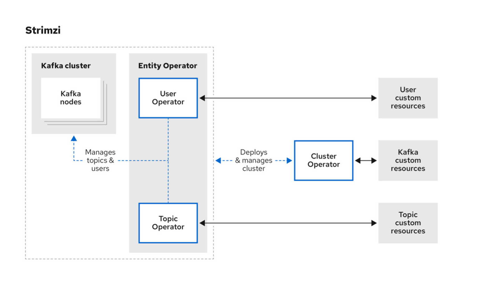

<!-- markdownlint-disable -->
# Kafka Cluster for Observability Project
[](https://en.wikipedia.org/wiki/Proprietary_software)
[](#)
[](https://artifacthub.io/packages/helm/strimzi/strimzi-kafka-operator)
[](#)
<!-- markdownlint-restore -->

## Table of contents

* [General](#general)
* [Prerequisites](#prerequisites)
* [Requirements](#requirements)
* [Preparation & Installation Steps](#preparations)
  * [Prepare Kafka-Worker-Nodes](#prepare-worker-nodes)
  * [Install Kafka-Operator](#install-kafka-operator)
  * [Install Kafka-Cluster](#install-kafka-cluster)
  * [Install Kafka-Schema-Registry (optional)](#install-confluent-kafka-schema-registry-optional)
  * [Install Kafka-OTEL-Core-Topics](#otel-core-topics)
  * [Install Kafka-OTEL-BU-Topics](#otel-edpbusiness-unit-topics)
* [Known Issues](#known-issues)
* [Links](#links)

## General

This repository uses the latest (strimzi) [Kafka-Operator](https://artifacthub.io/packages/helm/strimzi/strimzi-kafka-operator/) and a corresponding resource manifest for a KRaft guarded 3-broker-nodes cluster as well as a zookeeper based sample implementation for the same kafka version.

### Strimzi Kafka Architecture

#### What is the Strimzi Kafka Operator?

The **Strimzi Kafka Operator** is an open-source Kubernetes Operator that simplifies the deployment, management, and operation of **Apache Kafka clusters** on Kubernetes. Strimzi automates complex administrative tasks, making it easier to run Kafka in a cloud-native environment. Strimzi makes **Kafka on Kubernetes production-ready** by reducing operational complexity and enabling a fully automated, self-healing Kafka ecosystem. It is the **preferred solution** for teams running event-driven applications, data streaming platforms, and microservices in **cloud-native** environments.

For more details, visit: [https://strimzi.io/](https://strimzi.io/)

#### Why Use Strimzi for Kubernetes?

Running Apache Kafka in Kubernetes can be challenging due to its stateful nature. Strimzi addresses these challenges by:
- **Automating Kafka Deployment**: Deploys and manages Kafka brokers (using KRaft mode), and related components using Kubernetes-native resources.
- **Handling Scaling and Rolling Updates**: Supports seamless scaling and rolling upgrades with minimal downtime.
- **Ensuring High Availability**: Manages Kafka in a highly available manner with automated recovery and leader election.
- **Providing Security and Monitoring**: Integrates **TLS encryption, authentication, authorization**, and monitoring via Prometheus and Grafana.
- **Simplifying Cluster Configuration**: Uses **Custom Resource Definitions (CRDs)** to define Kafka clusters declaratively.

#### Key Features

- Kafka cluster deployment and scaling
- Automatic recovery and failover handling
- Kafka Connect and MirrorMaker support
- Built-in security mechanisms (TLS, SCRAM, OAUTH)
- Monitoring and metrics integration

|                          Strimzi Architecture                           |                         Strimzi Operator Schema                          |
|:-----------------------------------------------------------------------:|:------------------------------------------------------------------------:|
|  |  |

### Recommended Kafka Storage Classes

The current implementation provides two different storage classes, which are also made available system-wide at the time of provisioning (`001-kafka-storage-init.yaml`). Details on the two storage classes can be found in the table below.

| storageClass           | description                                                       |
|:-----------------------|:------------------------------------------------------------------|
| s1-iscsi-xfs-ephemeral | ephemeral storage class, xfs, iSCSI netapp storage, no-reclaim    |
| s1-iscsi-xfs-persist   | persistent storage class, xfs, iSCSI netapp storage, full-reclaim |

### Kafka Versions (supported)

| Kafka Image                                | description      |
|:-------------------------------------------|:-----------------|
| `quay.io/strimzi/kafka:0.45.0-kafka-3.9.0` | kafka-core 3.9.0 |
| `quay.io/strimzi/kafka:0.45.0-kafka-3.8.0` | kafka-core 3.8.0 |

### Kafka Users Available

All user passwords are defined in advance as secrets in the preflight process in order to be able to use them in the confluent schema registry and to give us a certain degree of additional flexibility with regard to a possible hashicorp vault integration.

| username                     | description                                                                          | password                           |
|:-----------------------------|:-------------------------------------------------------------------------------------|:-----------------------------------|
| `kafka-cluster-primary-root` | super user (cluster admin)                                                           | `m0sfVmtZEn02BCLutdrsOG8NHfFBTwwT` |
| `kafka-cluster-sandbox-root` | super user (cluster admin) -> sandbox cluster                                        | `wZuayZwbpVq6Sm0Pp7Eb0xPCqO2p9W5n` |
| `otel-default-rw`            | default open telemetry user, has access to all `otel-*` topics                       | `fhpPbafRkpmLTtVCv2a60cysPpSD6Awt` |
| `otel-network-rw`            | default open telemetry networking user, has access to all `otel-networking-*` topics | `gAa5TVEo0m7pizrTfUDIDspgczSJ58pg` |
| `otel-sandbox-rw`            | sandbox open telemetry user, has access to all `sbx-*` topics                        | `BWhC0vAsh9ezB4a0vBXv4EPTCgl2jvFs` |

## Prerequisites

Kafka Operator requires a Kubernetes cluster of version >=1.23.0. If you have just started with the CRD and Operators, its highly recommended using the latest version of Kubernetes.

## Requirements

To perform provisioning, you will need operational access to our rancher based rke2 cluster (the access certificate can be obtained from the Observability Team) and a corresponding toolset for local processing of Kubernetes api calls + kubernetes storage class access/performance tests.

- [kubectl](https://kubernetes.io/de/docs/tasks/tools/)
- (optional) [kubestr](https://github.com/kastenhq/kubestr)
- (optional) [jq](https://stedolan.github.io/jq/download/)

## Preparations

The following points describe the setup of the Kafka cluster using detailed step-by-step instructions, from the preparation of the worker nodes to the provisioning of the OTEL Kafka users/topics. If there are any problems with the implementation according to the given scheme, please supplement or adapt this documentation accordingly.

### Prepare Worker-Nodes

We use a node affinity to bind the Kafka Cluster members to a specific worker node subset of the Kubernetes cluster. This is done via a dedicated label selector, which is set in the preflight phase of the deployment. Adjustments to this can be made in the file `manifests/000-preflight.yaml`.

```
---
#
# node-8 (c1w8.observability.test.pndrs.de) 'kafka' labeling example
#
apiVersion: v1
kind: Node
metadata:
  name: c1w8.observability.test.pndrs.de
  labels:
    node-role.kubernetes.io/kafka: "true"
    app.kubernetes.io/managed-by: internal
    app.kubernetes.io/infra-version: "<current-infra-version>"
    app.kubernetes.io/part-of: kafka-cluster
    app.kubernetes.io/instance: poc-stable
    topology.kubernetes.io/region: eu-de-1
    topology.kubernetes.io/zone: az-2
    observability.branch: poc-dev
    observability.customer: internal
    kafka.priority: "high"
    env: dev
```

## Installation

We recommend installing all the components involved (see below) via the respective interpretations of these in our OpenTofu/Terragrunt stack. The control of the components in the context of Kubernetes can then be done as usual via `kubectl`.

> Please note that an active VPN connection (e.g. to the DEV environment) and the local embedding of the rke2-k8s-config in your `.kube/config` as `pndrs-observability` is required for access to the cluster and the corresponding authentication!

```bash
cd config/<environment>/<target-stack> ;
terragrunt init --terragrunt-tfpath tofu ;
terragrunt plan -lock=false --terragrunt-tfpath tofu ;
terragrunt apply --terragrunt-tfpath tofu ;
```

we recommend the use of corresponding alias definitions in your .shell-rc files:

```bash
alias tofp="terragrunt plan -lock=false --terragrunt-tfpath tofu"
alias tofa="terragrunt apply --terragrunt-tfpath tofu"
alias tof="terragrunt --terragrunt-tfpath tofu"
alias tofpall="terragrunt run-all plan --terragrunt-tfpath tofu -lock=false | grep -v \"Refreshing state...\\|Reading...\\|Read complete after\""
```


### Manual Installation of Kafka-Operator

#### Helm based provisioning

```bash
#
# install operator resources (e.g. install operator into 'int-estino-operator' namespace)
# --
# Add the helm chart
$ helm repo add strimzi https://strimzi.io/charts && helm repo update
...
"strimzi" has been added to your repositories

# Deploy the Kafka Operator and activate observer for a dedicated namespace "kafka-cluster" (using "latest" version)
$ helm upgrade --install kafka-operator strimzi/strimzi-kafka-operator \
  --namespace kafka-operator \
  --set defaultImageRegistry="" \
  --set defaultImageRepository=europe-west3-docker.pkg.dev/nz-mgmt-shared-artifacts-8c85/quay-io/strimzi \
  --set operator.enableKRaft=true \
  --set watchNamespaces="{kafka-cluster}"

...
Release "kafka-operator" does not exist. Installing it now.
NAME: kafka-operator
LAST DEPLOYED: Mon Feb 10 12:02:59 2025
NAMESPACE: kafka-operator
STATUS: deployed
REVISION: 1
TEST SUITE: None
NOTES:
Thank you for installing strimzi-kafka-operator-0.45.0

To create a Kafka cluster refer to the following documentation.

https://strimzi.io/docs/operators/latest/deploying.html#deploying-cluster-operator-helm-chart-str
```

### Manual Installation of Install Kafka-Cluster

The setup can be done by using kubectl/kustomized-command operator. The kafka-cluster can easily get installed using the following commands:

```bash
# install preflight + core resources
# --
$ kubectl kustomize ./manifests | kubectl apply -f -
```

### Manual Installation of Install Confluent Kafka Schema Registry (optional)

The **Confluent Kafka Schema Registry** is a key component in the Apache Kafka ecosystem for managing, validating, and versioning **Avro, JSON, and Protobuf schemas**. It provides a **RESTful API** that ensures producers and consumers adhere to defined schemas, preventing **compatibility issues** and enabling an **evolvable data architecture**.

#### Helm based provisioning

```bash
# install process
helm repo add bitnami https://charts.bitnami.com/bitnami
helm upgrade --install confluent-schema-registry bitnami/schema-registry -n kafka-cluster
# uninstall process
helm uninstall confluent-schema-registry -n kafka-cluster
kubectl delete pvc data-confluent-schema-registry-kafka-controller-0 -n kafka-cluster
```

## Kafka Data Ingestion

### Ingesting OpenTelemetry-Data into Kafka

To ingest OpenTelemetry data into your Kafka cluster, you need an OpenTelemetry Collector with the appropriate exporter and some Kafka configuration adjustments.

#### Install OpenTelemetry Kafka Exporter

```bash
# install the otel-collector
helm repo add open-telemetry https://open-telemetry.github.io/opentelemetry-helm-charts && helm repo update
helm upgrade --install otel-collector open-telemetry/opentelemetry-collector -n otel-collector
```

#### Prepare Kafka Topics for OpenTelemetry

The topics required for Open Telemetry (OTEL) are managed via a corresponding CRD (KafkaTopic) using the already installed EntityOperator (strimzi). The topics are already created during the kustomized installation of the cluster and can be adapted via the associated manifest `manifests/202-kafka-topics.yaml`.

> An important note: the KafkaTopic CRD allows a dedicated configuration/specialization of the topic to be described and, in addition to standard parameters, also enables the assignment of the important settings for replication and partitioning. These settings must be made before the topic is used; subsequent changes (after data receipt) are no longer possible.

##### OTEL Sandbox Topics

Here are the testing (sandboxing) topics for OTEL, which are automatically generated during the cluster setup.

| OTEL Topic            | description                                    | Replication | Partitions |
|:----------------------|:-----------------------------------------------|-------------|------------|
| `sbx-logs-normalized` | ingestion target for normalized telemetry logs | `3`         | `1`        |
| `sbx-logs-ingest`     | ingestion target for raw telemetry logs        | `3`         | `1`        |


##### OTEL Core Topics

Here are the standard topics for OTEL, which are automatically generated during the cluster setup. If these are not required, please simply delete them from the corresponding manifest or comment them out.

| OTEL Topic     | description                                 | Replication | Partitions |
|:---------------|:--------------------------------------------|-------------|------------|
| `otel-traces`  | ingestion target for open telemetry traces  | `3`         | `1`        |
| `otel-metrics` | ingestion target for open telemetry metrics | `3`         | `1`        |
| `otel-logs`    | ingestion target for open telemetry logs    | `3`         | `1`        |


##### OTEL EDP/Business-Unit Topics

We use additional Otel topics, which are zone, context and unit specific and are set with an appropriate prefix. A set of example topics is also set up at the time of Kafka cluster provisioning and must be adapted or extended for future application purposes.

| OTEL Topic                               | description                                   | Replication | Partitions |
|:-----------------------------------------|:----------------------------------------------|-------------|------------|
| `otel-networking-vedge-ber-az02-traces`  | ingestion target for network/az2 otel traces  | `3`         | `5`        |
| `otel-networking-vedge-ber-az02-metrics` | ingestion target for network/az2 otel metrics | `3`         | `5`        |
| `otel-networking-vedge-ber-az02-logs`    | ingestion target for network/az2 otel logs    | `3`         | `5`        |

## Access the cluster

I recommend the use of [kadeck](https://www.kadeck.com/get-kadeck) as a UI app for the Kafka cluster; the free version is completely sufficient from my point of view. 

> However, this external kafka access-method only works if the cluster networking, firewall port access and VPN connector/provider are adapted accordingly.

Alternatively, the [kadeck](https://www.kadeck.com/get-kadeck) WebUI can be used as a [Helm installation](https://gitlab.com/xeotekgit/kadeck-helm) or native deployment within the Kafka-carrying cluster. In this version there are also none of the above-mentioned problems concerning the network layer. A corresponding stack implementation will be available from version 0.9.8 of the IaC PoC.

### Get Kafka Root-User Credentials

By implementing the user-operator configuration in our init-manifest (`100-kafka-cluster-kraft.yaml`) we are able to create users directly via the corresponding `KafkaUser` CRD at any time. The x509/P12 authentication certificate associated with the user can be taken from the corresponding secret and then used in the connector. The repository includes a resource manifest for a test user and an associated test topic. After executing the corresponding provisioning (`k apply -f 100-kafka-cluster-kraft.yaml`) the user's credentials can be retrieved using the following command.

```bash
# super user (kafka-root)
$ kubectl get secret kafka-cluster-primary-root -n kafka-cluster -o go-template='{{range $k,$v := .data}}{{printf "%s: " $k}}{{if not $v}}{{$v}}{{else}}{{$v | base64decode}}{{end}}{{"\n"}}{{end}}'
$ kubectl get secret kafka-cluster-sandbox-root -n kafka-cluster-sbx -o go-template='{{range $k,$v := .data}}{{printf "%s: " $k}}{{if not $v}}{{$v}}{{else}}{{$v | base64decode}}{{end}}{{"\n"}}{{end}}'
# ...
# *** output
# password: <secret-password>
# sasl.jaas.config: org.apache.kafka.common.security.scram.ScramLoginModule required username="kafka-cluster-primary-root" password="<secret-password>";
#
# otel-default-rw (default open telemetry user)
$ kubectl get secret otel-default-rw -n kafka-cluster -o go-template='{{range $k,$v := .data}}{{printf "%s: " $k}}{{if not $v}}{{$v}}{{else}}{{$v | base64decode}}{{end}}{{"\n"}}{{end}}'
#
# otel-networking-rw (default open telemetry user)
$ kubectl get secret otel-networking-rw -n kafka-cluster -o go-template='{{range $k,$v := .data}}{{printf "%s: " $k}}{{if not $v}}{{$v}}{{else}}{{$v | base64decode}}{{end}}{{"\n"}}{{end}}'
#
# otel-sandbox-rw (default open telemetry sandbox/dev user)
$ kubectl get secret otel-sandbox-rw -n kafka-cluster -o go-template='{{range $k,$v := .data}}{{printf "%s: " $k}}{{if not $v}}{{$v}}{{else}}{{$v | base64decode}}{{end}}{{"\n"}}{{end}}'

```

### Handling OTEL User-Accounts

The existing `202-kafka-users.yaml` manifest is used to add further users to the Kafka cluster, which have been prepared for the planned Open Telemetry deployment with separately defined ACLs. These users are also created automatically in the course of the `customized` deployment and can be adapted (similar to our OTEL-Topics) according to the existing requirements. 


### Activate Port-Forwarding (for testing purpose only)

The use of port-forwarding is generally not recommended and is only listed here for the sake of completeness.

> A warning in advance: port-forwarding only works for testing the Kafka bootstrap handshake. SASL authentication and thus bound access to the topic engine or direct access to the Kafka engine is not possible via k8s port-forwards! This is a known problem and can only be solved by enabling ports in the firewall and configuring the VPN connector/provider accordingly (see #known-issues).

```bash
# quick run
kubectl port-forward service/kafka-cluster-poc-kafka-external-bootstrap -n kafka-cluster 9095:9095
# stable loop run
while true; do kubectl port-forward service/kafka-cluster-poc-kafka-external-bootstrap -n kafka-cluster 9095:9095 --address=127.0.0.1; done
```

## Desaster Recovery

In the event of a complete failure of the logical components of the stack (statefulset, services, CM, secrets) - or an unintentional uninstallation of the stack - the stack can be restored relatively easily due to the re-claim policy of the PVs concerned and the retain option of the associated PVCs. To do this, please use the following procedure, **which differs** from the [official documentation](https://strimzi.io/docs/operators/in-development/full/deploying.html#proc-cluster-recovery-volume-str)! (we use the namespace `kafka-cluster` in this example and assume a kafka-cluster named `otel-test`):

> The decisive factor for a successful recovery as part of a disaster recovery is the existence and logical availability of the persistent volume claims (pvc) used for the persistence of the kafka partitions and the connected perstistent volumes (pv)!

1. Ensuring the availability of PVCs/PVs
    ```bash
    # command
    kubectl get pvc -n kafka-cluster
    # output
    NAME                            STATUS   VOLUME                                     CAPACITY     ACCESS MODES   STORAGECLASS            VOLUMEATTRIBUTESCLASS   AGE
    data-0-otel-test-controller-0   Bound    pvc-f42a1a36-75d9-4268-9beb-fb734887797b   19531250Ki   RWO            s1-iscsi-ext4-persist   <unset>                 15h
    data-0-otel-test-controller-1   Bound    pvc-faccd03e-5d74-41e1-b0e5-c5efbc08b0b1   19531250Ki   RWO            s1-iscsi-ext4-persist   <unset>                 15h
    data-0-otel-test-controller-2   Bound    pvc-d270a5cc-f75f-42c1-8532-ec3d6d7de745   19531250Ki   RWO            s1-iscsi-ext4-persist   <unset>                 15h
    ```

2. Start of the stack via IaC redeployment
    ```bash
    # command
    cd config/dev/kafka-cluster;
    terragrunt apply;
    kubectl get pods -n kafka-cluster
    # output (dont panic! CrashLoopBackOff state is expected!)
    NAME                         READY   STATUS             RESTARTS      AGE
    pod/otel-test-controller-0   0/1     Running            2 (15s ago)   31s
    pod/otel-test-controller-1   0/1     CrashLoopBackOff   1 (5s ago)    31s
    pod/otel-test-controller-2   0/1     CrashLoopBackOff   1 (9s ago)    31s
    ```

3. Identification of the cluster ID “token” (or readout after the first crash loop start of the new stack)
    ```bash
    # command
    kubectl logs -f otel-test-controller-0 -n kafka-cluster 
    # output
    Exception in thread "main" java.lang.RuntimeException: Invalid cluster.id in: /var/lib/kafka/data-0/kafka-log0/meta.properties. Expected UHCGLVNgTM2osoNBe4_fqA, but read Rvw84U6tQnabTT-lqEZ9dA
      at org.apache.kafka.metadata.properties.MetaPropertiesEnsemble.verify(MetaPropertiesEnsemble.java:503)
      at org.apache.kafka.metadata.storage.Formatter.doFormat(Formatter.java:386)
      at org.apache.kafka.metadata.storage.Formatter.run(Formatter.java:248)
      at kafka.tools.StorageTool$.runFormatCommand(StorageTool.scala:150)
      at kafka.tools.StorageTool$.execute(StorageTool.scala:86)
      at kafka.tools.StorageTool$.main(StorageTool.scala:46)
      at kafka.tools.StorageTool.main(StorageTool.scala)
    # cluster-id requested (use this)
    UHCGLVNgTM2osoNBe4_fqA
    # cluster-id identified (patch that)
    Rvw84U6tQnabTT-lqEZ9dA
    ```

4. Modification of the cluster ID in all ConfigMaps of all participating controller pods
    ```bash
     kubectl patch cm otel-test-controller-0 -n kafka-cluster-sbx --type merge -p '{"data":{"cluster.id":"uSI5cebIQAGfKXt7GYvz1g"}}'
     kubectl patch cm otel-test-controller-1 -n kafka-cluster-sbx --type merge -p '{"data":{"cluster.id":"uSI5cebIQAGfKXt7GYvz1g"}}'
     kubectl patch cm otel-test-controller-2 -n kafka-cluster-sbx --type merge -p '{"data":{"cluster.id":"uSI5cebIQAGfKXt7GYvz1g"}}'
    ```

5. Restart/reset the relevant controller pods
    ```bash
    # example script (pseudo code)
    while true; do
      PODS=$(kubectl get pods -n kafka-cluster-sbx --no-headers -o custom-columns=":metadata.name" | grep "otel-test-controller")
      if [[ -z "$PODS" ]]; then
        echo "[ok] All Kafka controller pods have been successfully deleted and restarted."
        break
      fi
    
      echo "[do] Delete the following Kafka controller pods:"
      echo "$PODS"
    
      for POD in $PODS; do
        kubectl delete pod $POD -n kafka-cluster-sbx
      done
    
      echo "[do] Wait 3 seconds before the next check..."
      sleep 3
    done
    ```

6. Check pod stability
    ```bash
    # command
    kubectl get pods -n kafka-cluster
    # output
    NAME                                         READY   STATUS    RESTARTS   AGE
    otel-test-controller-0                       1/1     Running   0          14h
    otel-test-controller-1                       1/1     Running   0          14h
    otel-test-controller-2                       1/1     Running   0          14h
    otel-test-entity-operator-685d5d5d69-jzrpt   2/2     Running   0          14h
    ```

## Known Issues

> K8S-PORT-FORWARD not working

    - Kubernetes **port-forwarding is not compatible with Kafka’s network model**. A VPN, LoadBalancer, or proxy-based setup is required for stable connectivity.
    - Kafka relies on **advertised listeners** and a **proprietary packet format** that does not work well with Kubernetes' `kubectl port-forward`.


> KUBECTL-Provider issue(s)
    - GPG Key for gavinbunney/kubectl v1.14.0 is invalid
    - set this provider to your local ignore-list or disable GPG checks for opentofu

## Ideas & Feature-requests

> Ideas or feature requests for improving the general stack, structural adjustments or process optimisations as a whole can be submitted here. There are no specifications for the points listed here, everyone can contribute accordingly; at the end of each sprint iteration, an internal vote should be held on these points in order to be able to plan the actual implementation. The listing here is for documentation purposes only and should be part of the respective stack in the repositories. Please Prefix Feature-Requests with **FEAT** (FEAT-YEAR-NUM/ID).

## Links

### Core Documentation

- Kafka Operator: https://artifacthub.io/packages/helm/strimzi/strimzi-kafka-operator
- Kafka Operator Documentation: https://strimzi.io/docs/operators/latest/overview.html
- Kafka Config Examples (advanced): https://strimzi.io/docs/operators/latest/deploying#config-examples-str
- Kafka Cluster Examples: https://strimzi.io/docs/operators/latest/overview.html#configuration-points-broker_str
- Kafka User Operator Practical: https://stackoverflow.com/questions/64888318/want-some-practical-example-how-to-use-kafkauser
- Kafka Certs: https://strimzi.io/docs/operators/latest/full/configuring.html#ca_certificates
- Kafka Auth: https://strimzi.io/docs/operators/in-development/configuring.html#con-securing-client-authentication-str
- Kafka Ingress: https://7eben.dev/2020-10-20-kafka-in-k8s-part-2/
- Kafka-CleanUp Policies: https://docs.confluent.io/platform/current/installation/configuration/topic-configs.html#:~:text=cleanup.&text=The%20%E2%80%9Ccompact%E2%80%9D%20policy%20will%20enable,%E2%80%9Cdelete%2Ccompact%E2%80%9D).
- Kafka-Compression Overview: https://levelup.gitconnected.com/optimizing-kafka-message-compression-ed51b89f01d5
- Kafka Partitions: https://www.kadeck.com/blog/how-many-partitions-do-i-need-in-apache-kafka
- Kafka Strimzi Tuning (2021): https://strimzi.io/blog/2021/06/08/broker-tuning/
- Kafka Production Recommendations: https://docs.confluent.io/platform/current/kafka/deployment.html
- Kafka Default Value(s) best practices: https://www.javierholguera.com/2018/06/13/kafka-defaults-that-you-should-re-consider-i/
- Kafka Log Retention: https://www.conduktor.io/blog/understanding-kafkas-internal-storage-and-log-retention/
- Kafka Producer Idempotency: https://www.conduktor.io/kafka/idempotent-kafka-producer/

### Kafka Connectors

- Kafka Camel Connector Source: https://camel.apache.org/camel-kafka-connector/3.20.x/reference/index.html
- Kafka Connector, Regex Pattern: https://docs.confluent.io/platform/current/connect/transforms/regexrouter.html
- Kafka Connector SMTs: https://www.confluent.io/blog/simplest-useful-kafka-connect-data-pipeline-world-thereabouts-part-3/

### Schema Registry

- Official Confluent Documentation: https://docs.confluent.io/platform/current/schema-registry/index.html
- Bitnami Helm-Chart: https://artifacthub.io/packages/helm/bitnami/schema-registry

### Client Documentation (code)

- https://github.com/segmentio/kafka-go
- https://docs.aiven.io/docs/products/kafka/howto/connect-with-go

### Apps, metrics & more

- https://www.kadeck.com/get-kadeck
- https://grafana.com/grafana/dashboards/18276-kafka-dashboard/

## License

[Proprietary Software License](LICENSE.md)

## Copyright

Copyright © 2024-2025 [50Hertz Transmission GmbH](https://www.50hertz.com/de/)